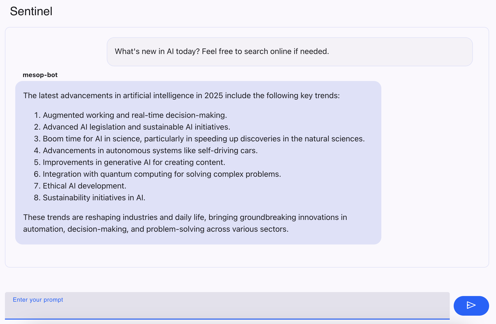

# 🛰️ Sentinel – Your AI-powered Information Watchdog
Sentinel is a personal AI agent designed to track, summarize, and contextualize current information across domains like data science, AI, politics, and economics. Powered by multiple tools and intelligent reasoning, it offers a modular, interactive interface to stay ahead of the curve — hands-free.



## 🚀 Features
- 🔎 Real-time Web Search: Uses DuckDuckGo to fetch and analyze the latest updates.
- 🌐 Smart Website Crawling: Crawls specific URLs for structured, rich content extraction.
- 🧠 Contextual Summarization: Condenses long-form text into clean, readable summaries.
- 💬 Conversational Memory: Retains and recalls conversation history for continuity.
- 🧰 Modular Tools Framework: Easily extensible and built on LangChain’s ReAct agent architecture.
- 🧩 Mesop UI Integration: Lightweight UI for interactive chatting in notebooks or apps.

## 🛠️ Tech Stack
- **LangChain + LangGraph** – agent orchestration & tools
- **OpenAI** – chat model backend
- **DuckDuckGo** – search integration
- **crawl4ai** – custom async web crawler
- **Mesop** – frontend for chat UX

## ⚙️ How It Works
Sentinel is built around a set of tools that the agent can call autonomously based on your query:

Tool	Description
DuckDuckGoSearch	Search the web for real-time, factual updates
crawl_website	Extract structured content from web pages
summarize	Generate concise summaries from long content
conversation_history	Retrieve past conversation context
The agent uses a ReAct (Reasoning + Action) framework to decide which tool(s) to use, execute them in order, and return a well-structured response.

## 💬 Usage (CLI)
```
uv sync
uv run mesop main.py
```

Then, go to this link  : http://localhost:32123

## 📘 Example Query Flows

```
User: What's the latest on French economic policy?
→ Search tool → Crawl a government site → Summarize content → Return structured brief

User: Summarize this webpage from a data science news website
→ Crawl the URL → Extract content → Summarize
```

## 🤖 About the Name
Sentinel stands for vigilance. It’s not just a bot — it’s your digital lookout, proactively bringing you insights that matter, when they matter.


